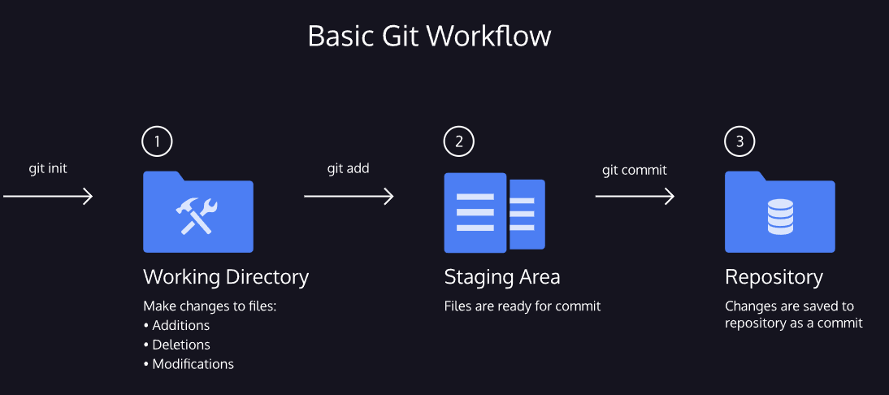

Introduction to Git

Now that you're able to run Python programs locally, it's a great time to introduce another important tool that developers use every day: Git. In this section, you'll learn the basics of Git and how to create a repository to manage your projects.

If you're curious about what Git is and how it's used, feel free to check out the video below. It covers a lot of ground, so don’t worry if everything doesn’t click right away—that's totally normal.

The upcoming lessons will give you a solid introduction to how Git works. While we’re focusing on the essentials for now so we can return to Python, there's plenty more to explore. If you're interested in going deeper, we recommend checking out our full Git course, which covers the topic in much more detail.

Once you complete this Git section, you’ll start your largest project yet—bringing together many of the Python skills you’ve built so far. While you're welcome to complete the project on Codecademy, it's also a great opportunity to try working locally with the command line and Git.

You can also find a helpful Git cheat sheet here:
Git Cheat Sheet (PDF)

https://education.github.com/git-cheat-sheet-education.pdf